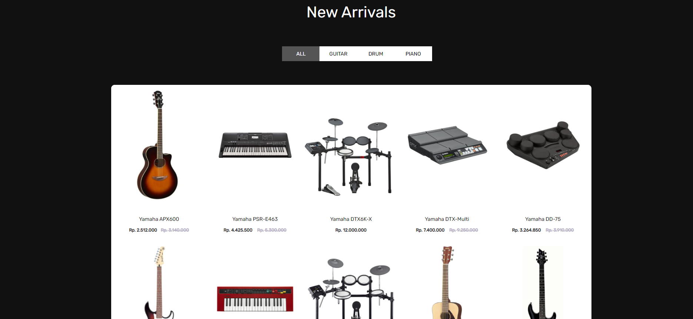

# Orbis Store
> Music store website based on HTML, CSS, and Javascript.
> Live demo [_here_](https://orbis-store.netlify.app/).

## Table of Contents
* [General Info](#general-information)
* [Technologies Used](#technologies-used)
* [Features](#features)
* [Screenshots](#screenshots)
* [Setup](#setup)
* [Project Status](#project-status)
* [Contact](#contact)

## General Information
- This is a music store website that features various musical instruments such as guitars, drums and others.
- This website applies a simple and minimalist style so that users are easier to access

## Technologies Used
- HTML5
- CSS3
- Javascript ES6

## Features
- Homepage.
- Product List.
- Product Details.
- Shopping Cart.

## Screenshots

## Setup
To run this project, running it locally using live-server or open the index.html file.

## Project Status
Project is: _in progress._ <!-- / _complete_ / _no longer being worked on_. reason ? -->

## Contact
Created by [@Zulhaditya](https://itsmyportofolio.netlify.app/) - feel free to contact me!
